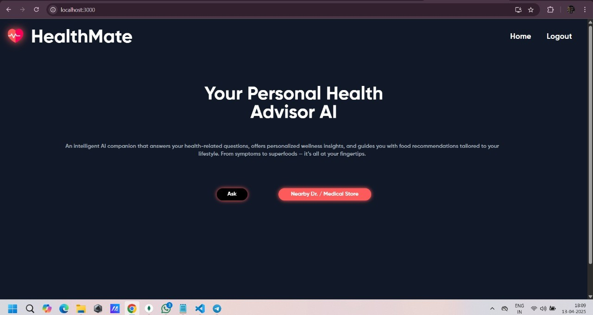
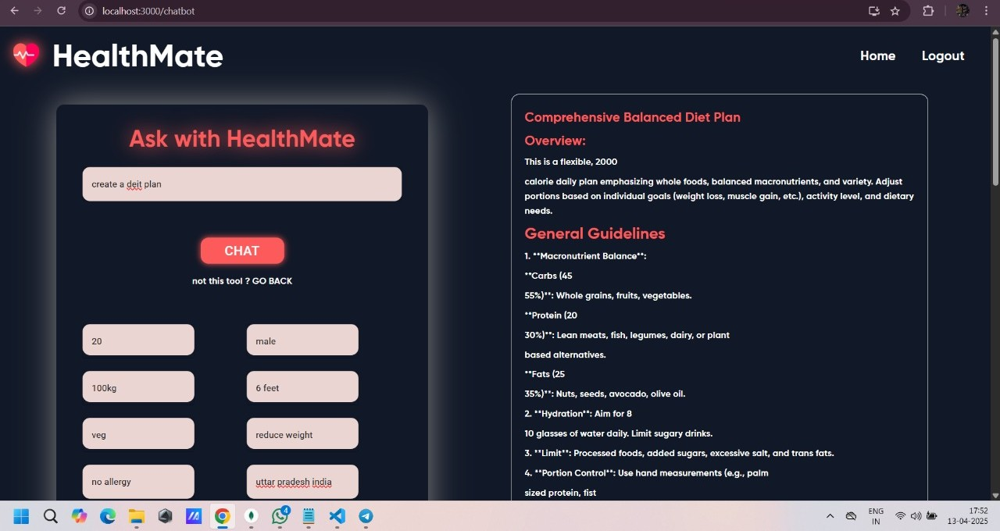

# 💬 HealthMate – AI-Powered Personalized Health Chatbot

HealthMate is an AI-driven virtual health assistant that provides personalized wellness checkups, custom diet and exercise plans, food recommendations, and localized medical insights — all tailored to individual user needs. Designed to make proactive health management simple, accessible, and smart.

---

## 🚀 Overview

In today's fast-paced world, maintaining good health requires more than just good intentions — it requires personalized, data-driven support. HealthMate empowers users to take charge of their health through intelligent guidance powered by AI. From meal suggestions to exercise routines, from calorie tracking to air quality–based recommendations, HealthMate offers a holistic, personalized health companion right at your fingertips.

---

## 🎯 Problem Statement

Access to personalized healthcare can often be expensive and time-consuming. Many people struggle to maintain healthy habits due to a lack of clear guidance tailored to their specific health needs. HealthMate addresses this challenge by delivering a free, AI-powered platform that provides customized health insights to users based on their body type, goals, health conditions, and environment.

---

## 🧠 Key Features

- ❓ **Health Query & Medicine Info Support**  
  Users can ask health-related queries, learn about various diseases, and get informative insights about medicines and their uses.

- 🍱 **Customized Diet & Workout Plans**  
  Offers diet and fitness routines based on user's health goals, body metrics, and specific health conditions.

- 🔍 **Food Insights & Calorie Calculator**  
  Enter any food item to receive nutritional information and get AI-driven advice on whether it’s suitable for your body and health goals.

- 🩺 **Health Condition–Specific Advice**  
  Dynamic adjustment of plans based on conditions like diabetes, thyroid, Blood Pressure, etc.

- 🌫️ **Environment-Aware Recommendations**  
  Uses real-time data on air quality, temperature, and pollution to offer region-specific health suggestions.

---

## 🛠️ Tech Stack

- **Frontend(client-side):**
  - HTML – structure of the page

  - CSS – styling (basic)

  - Tailwind CSS – utility-first CSS framework for styling

  - JavaScript – adds interactivity

  - React – frontend JavaScript framework for building UI

  - Material UI (MUI) – React UI component library (used in frontend)  
- **Backend(server-side):**
  - Node.js – runtime to run JavaScript on the server

  - Express.js – web framework for Node.js to build APIs

  - MongoDB – NoSQL database (stores your data)  
- **Libraries/Tools:**
  - Tailwind CSS – (frontend styling library)

  - Material UI – (React component library)

  - Express – (Node backend framework)
- **API Key Website Link:**
  - https://openrouter.ai/

---

## 🖼️ Demo

**Images**
  - 
  - 


---

## 🚧 Future Improvements

- 🌐 Multilingual support for regional access

- 🧘 Mental wellness and meditation assistant

- 📊 Health progress dashboard with visual analytics

- 🏥 Displays nearby medical resources

- 💬 Integrating Community Feedback

- 🎥 Video Content Library

---

## 📦 Getting Started

### Prerequisites
  - Make sure you have the following installed:

  - Node.js (v14+ recommended)

  - Git

  - MongoDB (local or cloud via MongoDB Atlas)

### Installation

```bash
# Clone the repository
git clone https://github.com/VishalDeval/devXhack_AMUHACK4.0.git
cd devXhack_AMUHACK4.0

# Install dependencies
npm install

# Run the app
npm start

```` 
--- 

## 👥 Contributors
- [@VishalDeval](https://github.com/VishalDeval)
- [@abhishek97-co](https://github.com/abhishek97-co)
- [@pragyanshgupta001](https://github.com/pragyanshgupta001)

---

#AMUHACKS 4.0 #CSSAMU #AMU